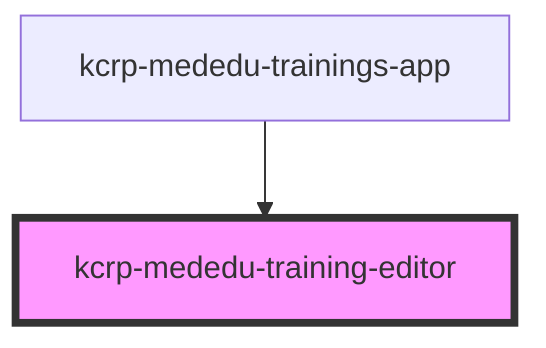

# kcrp-mededu-training-editor

<!-- Auto Generated Below -->

## Properties

| Property     | Attribute     | Description | Type                 | Default  |
| ------------ | ------------- | ----------- | -------------------- | -------- |
| `apiBase`    | `api-base`    |             | `string`             | `''`     |
| `backHref`   | `back-href`   |             | `string`             | `''`     |
| `trainingId` | `training-id` |             | `string`             | `'@new'` |
| `userRole`   | `user-role`   |             | `"employee" \| "hr"` | `'hr'`   |

## Events

| Event                | Description | Type                        |
| -------------------- | ----------- | --------------------------- |
| `training-archived`  |             | `CustomEvent<string>`       |
| `training-cancelled` |             | `CustomEvent<void>`         |
| `training-deleted`   |             | `CustomEvent<string>`       |
| `training-saved`     |             | `CustomEvent<TrainingForm>` |

## Dependencies

### Used by

 - [kcrp-mededu-trainings-app](../kcrp-mededu-trainings-app)

### Graph

----------------------------------------------

*Built with [StencilJS](https://stenciljs.com/)*
