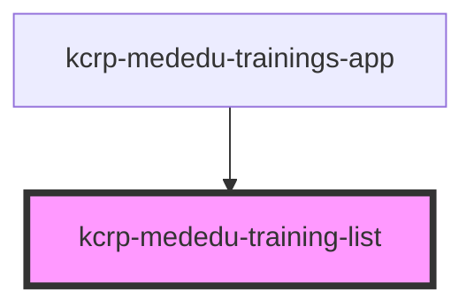

# kcrp-mededu-training-list

<!-- Auto Generated Below -->

## Properties

| Property           | Attribute            | Description | Type                 | Default |
| ------------------ | -------------------- | ----------- | -------------------- | ------- |
| `apiBase`          | `api-base`           |             | `string`             | `''`    |
| `createHref`       | `create-href`        |             | `string`             | `''`    |
| `trainingHrefBase` | `training-href-base` |             | `string`             | `''`    |
| `userRole`         | `user-role`          |             | `"employee" \| "hr"` | `'hr'`  |

## Events

| Event                     | Description | Type                  |
| ------------------------- | ----------- | --------------------- |
| `training-clicked`        |             | `CustomEvent<string>` |
| `training-create-clicked` |             | `CustomEvent<void>`   |

## Dependencies

### Used by

 - [kcrp-mededu-trainings-app](../kcrp-mededu-trainings-app)

### Graph

----------------------------------------------

*Built with [StencilJS](https://stenciljs.com/)*
