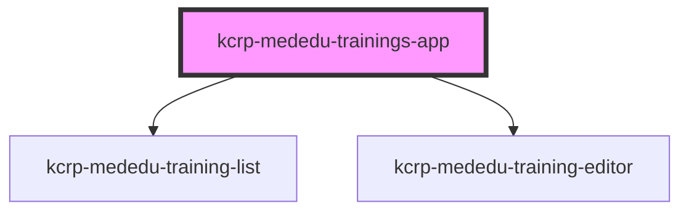

# kcrp-mededu-trainings-app

<!-- Auto Generated Below -->

## Properties

| Property   | Attribute   | Description | Type     | Default                     |
| ---------- | ----------- | ----------- | -------- | --------------------------- |
| `apiBase`  | `api-base`  |             | `string` | `''`                        |
| `basePath` | `base-path` |             | `string` | `'/kcrp-mededu-trainings/'` |

## Dependencies

### Depends on

- [kcrp-mededu-training-list](../kcrp-mededu-training-list)
- [kcrp-mededu-training-editor](../kcrp-mededu-training-editor)

### Graph

----------------------------------------------

*Built with [StencilJS](https://stenciljs.com/)*
